# Robô em Telegram para previsão de vendas de lojas Rossman com modelos de regressão.

## Contexto

A Rossmann opera mais de 3.000 farmácias em 7 países europeus. Atualmente, os gerentes de loja têm a tarefa de prever suas vendas diárias com até seis semanas de antecedência. As vendas são influenciadas por diversos fatores, incluindo promoções, concorrência, feriados escolares e estaduais, sazonalidade e localidade. Com milhares de gerentes prevendo vendas com base em suas circunstâncias específicas, a precisão dos resultados pode ser bastante variável.

## Objetivo

Prever 6 semanas de vendas diárias para 1.115 lojas localizadas em toda a Alemanha. Previsões de vendas confiáveis permitem que os gerentes de loja criem escalas de funcionários eficazes que aumentam a produtividade e a motivação.

## Fonte dos dados

Dados obtidos da plataforma Kaggle.
https://www.kaggle.com/competitions/rossmann-store-sales

# Planejamento da solução

## Produto final

No final do processo, deve-se ter um modelo treinado, com performance devidamente metrificada e avaliada, capaz de prever o volume financeiro de vendas das lojas contidas no conjunto de dados sendo fornecidas as demais variáveis que impactam nas vendas para o período de 6 semanas.

As previsões devem ser realizadas através de uma API. A interface com o usuário deve ser feita por meio de um chatbot de Telegram, onde o usuário informará o número de identificação da loja e o robô responderá com a previsão de receita das vendas para as próximas 6 semanas.

## Algoritmos ensaiados

**Algoritmos:** Regressão Linear, Regressão Linear Regularizada (Lasso), Random Forest Regressor, XGBoost Regressor, MLP Regressor.
**Métricas de performance:** R2, RMSE, MAE e MAPE.

## Principais ferramentas utilizadas

Python 3.11, Scikit-learn, XGBoost, BorutaPy, BayesSearchCV, Flask e Railway Cloud (host da API).

# Desenvolvimento

## Estratégia da solução

O procedimento para o desenvolvimento da solução foi estruturado para se adequar ao método CRISP-DS para projetos de desenvolvimento de algoritmos de machine learning, o que permite o aprimoramento cíclico dos resultados até a obtenção de métricas satisfatórias. Os passos seguidos foram:

- Passo 1: Descrição geral, formatação dos dados e tratamento de dados vazios.
- Passo 2 e 3: Criação de variáveis derivadas, filtragem dos dados e levantamento de hipóteses pertinentes ao negócio.
- Passo 4: Análise exploratória de dados com validação das hipóteses.
- Passo 5: Separação dos dados em bases de treino, validação e teste e preparação dos dados para utilização em algoritmos de machine learning com aplicação de scalers, enconders e transformações de natureza dos dados.
- Passo 6: Seleção de variáveis relevantes para os modelos utilizando como guia um método de seleção de variáveis por subset (BorutaPy).
- Passo 7: Ensaios com vários algoritmos para seleção do mais adequado, utilizando métricas de performance como base para a seleção.
- Passo 8: Otimização de hiperparâmetros para o modelo selecionado utilizando o método Baysiano de otimização.
- Passo 9: Estudo do erro do modelo treinado para avaliar sua performance e elaboração de métricas voltadas para o negócio.
- Passo 10: Simulação em jupyter notebook do processo de processamento dos dados de produção, geração de previsão das vendas e entrega dos resultados.
- Passo 11: Construção da API e chatbot, primeiro construindo uma API para execução na máquina local, depois elaboração do webapp (API) para processamento de dados e geração da previsão e construção do chatbot para fazer a interface com o usuário.

Cada passo, até o 10º, foi realizado dentro de um jupyter notebook, podendo serem acessados na pasta notebooks.

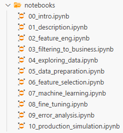

# Resultados

## Mapeamento das variáveis

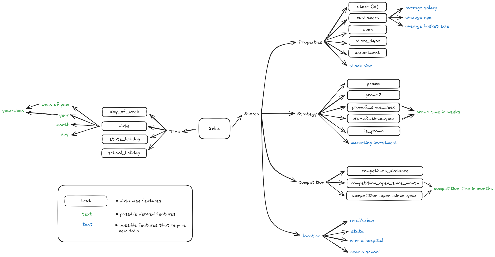

Durante a etapa de exploração dos dados foi feito mindmap das variáveis do modelo com algumas sugestões de novas variáveis cujo levantamento pode ser útil para uma melhora na performance.

**Variáveis**

- **Id** - Um número de identificação para cada par (Store, Date).
- **Store** - Identificador único de loja.
- **Sales** - O faturamento de um determinado dia (variável alvo).
- **Customers** - O número de clientes em um determinado dia.
- **Open** - Um indicador para saber se a loja estava aberta: *0 = fechada*, *1 = aberta*.
- **StateHoliday** - Indica um feriado estadual. Normalmente, todas as lojas, com poucas exceções, fecham em feriados estaduais. Todas as escolas fecham em feriados e fins de semana. *a = feriado, b = Páscoa, c = Natal, 0 = Nenhum*.
- **SchoolHoliday** - Indica se a (Loja, Data) foi afetada pelo fechamento das escolas públicas.
- **StoreType** - Diferencia entre 4 modelos de loja diferentes: *a, b, c, d*.
- **Assortment** - Descreve um nível de variedade: *a = básico, b = extra, c = estendido*.
- **CompetitionDistance** - Distância em metros até a loja concorrente mais próxima.
- **CompetitionOpenSince[Month/Year]** - Fornece o ano e o mês aproximados da abertura da loja concorrente mais próxima.
- **Promo** - Indica se uma loja está realizando uma promoção naquele dia.
- **Promo2** - Indica uma promoção contínua e consecutiva para algumas lojas: *0 = a loja não está participando, 1 = a loja está participando*.
- **Promo2Since[Year/Week]** - Descreve o ano e a semana do calendário em que a loja começou a participar da Promo2.
- **PromoInterval** - Descreve os intervalos consecutivos em que a Promoção2 está iniciada, indicando os meses em que a promoção é reiniciada. Por exemplo, "Feb,May,Aug,Nov" significa que cada rodada começa em fevereiro, maio, agosto e novembro de qualquer ano para aquela loja.

**Descrição das possíveis variáveis derivadas:**

- **promo_time_week**: Tempo de promoção convertido para semanas.
- **competition_time_month**: Tempo de existência da concorrência em meses.
- **day**: Desmembramento da parcela de dia da data.
- **month**: Desmembramento da parcela de mês da data.
- **year**: Desmembramento da parcela de ano da data.
- **week_of_year**: Transformação da data em número da semana do ano.
- **year_week**: Par ano-semana correspondente à data.

**Descrição das ideias de novas variáveis para serem levantadas:**

- **average_salary**: Renda média dos clientes que frequentam a loja.
- **average_age**: Idade média dos clientes que frequentam a loja.
- **average_basket_size**: Volume médio (financeiro) por compra dos clientes que frequentam a loja.
- **stock_size**: Volume médio (financeiro) dos estoques da loja.
- **marketing_investment**: Volume médio (financeiro) gasto em marketing por loja.
- **rural_urban**: Localização da loja categorizada entre local urbano ou rural.
- **state**: Localização da loja categorizada por província.
- **near_hospital**: Localização da loja categorizada por proximidade a um hospital.
- **near_school**: Localização da loja categorizada por proximidade a uma escola.

## Comparativo dos modelos testados

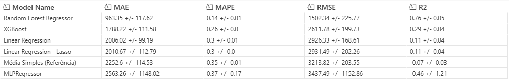

Os resultados estão ordenados do menor RMSE para o maior. O modelo de Média Simples é um modelo de referência que tenta realizar as previsões da forma mais simples possível, ou seja, tirando a média dos dados passados, os outros modelos precisam, necessariamente, desempenhar melhor que este para serem considerados minimamente úteis.

Embora o Random Forest Regressor tenha obtido um desempenho muito superior aos demais, é um algoritmo muito pesado computacionalmente e também em tamanho de arquivo. Podendo gerar altos custos de hospedagem em um servidor. A estratégia adotada para contornar a situação foi a utilização do segundo algoritmo da lista, o **XGBoost**, que é um algoritmo muito mais leve. A ideia é tentar, por meio do processo de otimização, fazer com que o desempenho do algoritmo fique tão bom quanto o do Random Forest.

## Desempenho do modelo otimizado

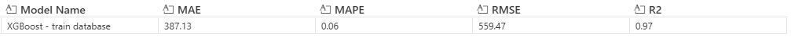

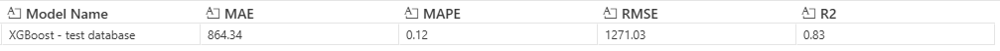

Após o processo de otimização, o XGBoost obteve um desempenho bastante razoável nos dados de teste podendo ser mantido como algoritmo selecionado para utilização na produção.

A verificação de performance foi feita tanto na base de dados de treino quanto na de teste para verificar o tamanho da perda de performance entre dados vistos e não vistos pelo modelo. Geralmente quando a queda é muito abrupta, pode ser um indicativo de overfittng, porém a queda observada está dentro do esperado. Isso pode ser observado principalmente pelo R2 que caiu apenas 0,14 pontos, indicando boa generalização.

## Explicabilidade do modelo otimizado

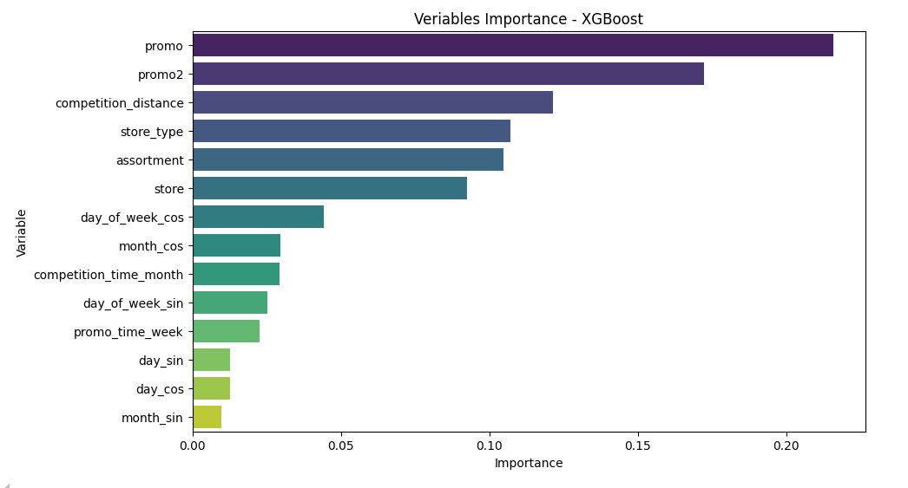

Para ajudar na explicabilidade do modelo, foi feito um levantamento da importância que cada variável selecionada possui para o modelo otimizado. É importante ressaltar que essa medida de importância não necessariamente se traduz em poder preditivo da variável, mas pode servir como indicativo disso para uma exploração mais profunda.

## Métricas de negócio - por loja

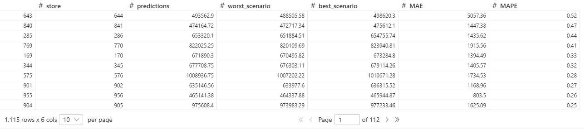

Elaboração de cenários para cada loja, onde o parâmetro escolhido para definição do pior e melhor cenário é o erro médio absoluto (MAE), por ser de mais fácil compreensão para um publico voltado à negócios.

## Métricas de negócio - geral

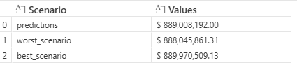

Elaboração de cenários para todas as lojas juntas.

## Análise do erro do modelo na base de teste

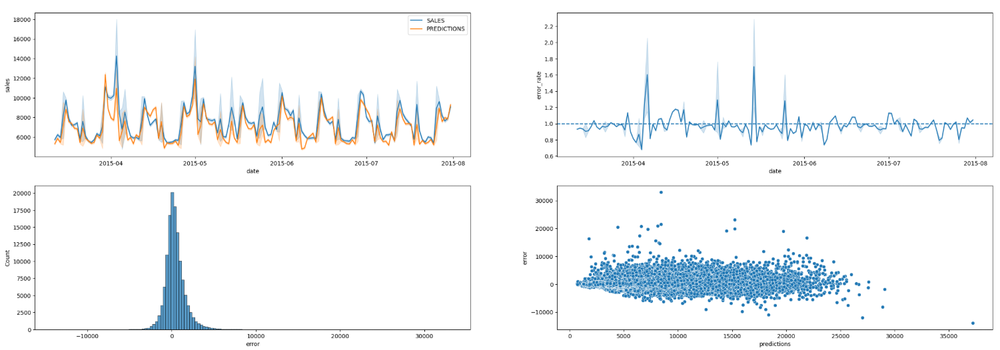

Gráficos que comparam o desempenho do modelo em relação aos dados reais ocorridos.

Gráfico 1 (superior esquerdo) - Compara as previsões do modelo com os dados reais para visualização do grau de desvio.

Gráfico 2 (superior direito) - Mostra se o erro está sendo positivo ou negativo em relação ao tempo. Esse gráfico demostra se há viés do modelo em errar para mais ou para menos o valor das vendas. O ideal é que não haja viés.

Gráfico 3 (inferior esquerdo) - Mostra a distribuição dos erros. O ideal é que a distribuição dos erros formem uma curva normal.

Gráfico 4 (inferior direito) - Mostra a distribuição do erro em relação à intensidade da previsão. O ideal é que os erros fiquem concentrados em torno de um único patamar horizontal, pois os erros não devem variar conforme a intensidade do valor previsto.

## Arquitetura do aplicativo local

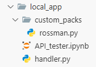

A versão local segue o seguinte processo:

1. O arquivo API_tester.ipynb é um notebook que carregará os dados e os filtra para a(s) loja(s) que deseja-se saber a previsão.
2. Ele envia os dados para o handler.py solicitando uma previsão.
3. O handler.py envia os dados para o rossman.py para o processamento dos dados.
4. O rossman.py carrega os scalers e encoders e realiza o processamento dos dados. Ele também possui a função para realização da previsão.
5. Então, envia os dados processados junto com a função de previsão.
6. Carrega-se o modelo de previsão e gera-se a previsão.
7. Envia-se a previsão para o API_tester.ipynb

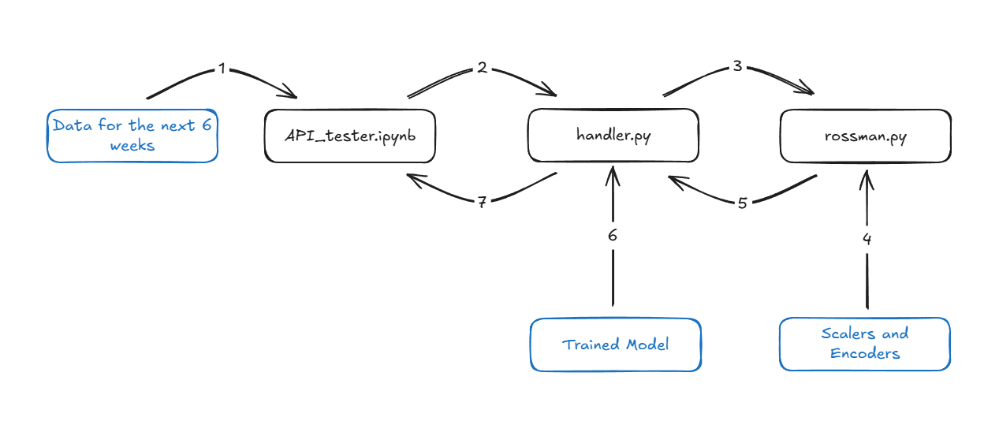

## Arquitetura do Webapp

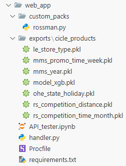

O processo é o mesmo do aplicativo local, mas os arquivos handler.py e rossman.py, junto com o modelo treinado e os scalers e encoders, ficam hospedados em um domínio remoto. O serviço de hospedagem utilizado foi o Railway, mas pode-se utilizar qualquer outro como, por exemplo, o Heroku.

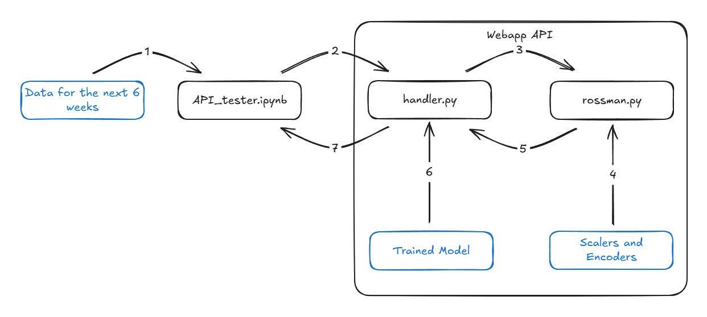

## Arquitetura do chatbot de Telegram

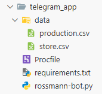

Agora as funções realizadas pelo API_tester.ipynb são assumidas pelo rossmann-bot.py que, juntamente com os dados de produção, ficam hospedados remotamente.

1. O usuário digita o número da loja que deseja-se fazer a previsão.
2. O arquivo rossmann-bot.py carrega os dados e os filtra para a(s) loja(s) que deseja-se saber a previsão.
3. Ele envia os dados para o handler.py solicitando uma previsão.
4. O handler.py envia os dados para o rossman.py para o processamento dos dados.
5. O rossman.py carrega os scalers e encoders e realiza o processamento dos dados. Ele também possui a função para realização da previsão.
6. Então, envia os dados processados junto com a função de previsão.
7. Carrega-se o modelo de previsão e gera-se a previsão.
8. Envia-se a previsão para o rossmann-bot.py.
9. O rossmann-bot.py envia a previsão em forma de mensagem para o Telegram do usuário.

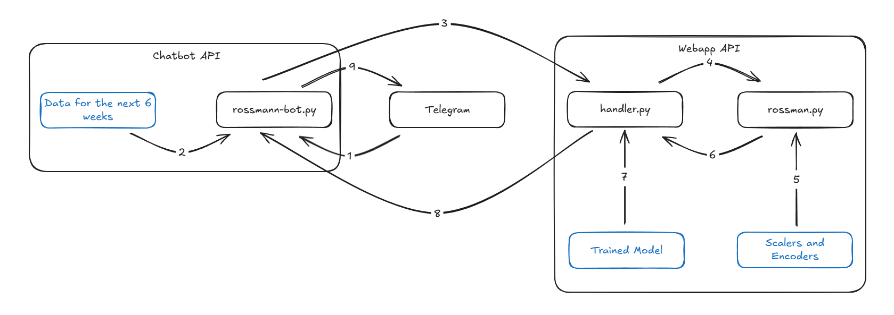

Visão do usuário:

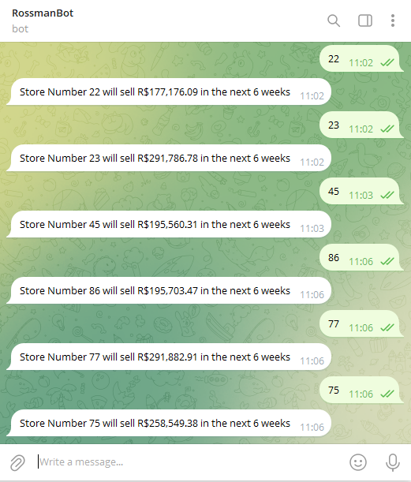

# Conclusão

O modelo desenvolvido obteve métricas satisfatórias de desempenho e generalização para dados não vistos, embora ainda haja espaço para melhoria das métricas. Isso pode ser visualizado principalmente pela métrica R² que demonstra que a lógica de regressão do modelo explica 83% da variação do comportamento das vendas e pelo MAPE que mostra que o erro médio do modelo fica em torno de 12% do valor real.

# Próximos passos

Como próximos passos pode-se analisar os outliers encontrados na análise do erro do modelo para verificar as condições em que eles ocorrem, o que pode ser útil para inclusão de novas variáveis no modelo.

No passo 4 foi levantado um mapa de variáveis onde possíveis novas variáveis foram ponderadas para ampliação futura do dataset.

Também pode-se testar modelos de regressão para séries temporais como ARIMA, SARIMA e Prophet, que baseiam-se principalmente no comportamento da variável alvo (vendas) no decorrer do tempo.

---

# Instalação

## Passo 1

Criar um ambiente virtual em uma plataforma de sua escolha usando a **versão 3.11.13** do Python.

## Passo 2

Instalar os pacotes necessários através do seguinte comando:

```python
pip install -r requirements.txt
```

O comando deve ser executado a partir do diretório raiz do projeto, onde está localizado o arquivo requirements.txt.

## Passo 3

O projeto está instalado.

---

# Configuração dos aplicativos

## Aplicativo local

Inserir o caminho até o repositório de arquivos do projeto no arquivo rossman.py:

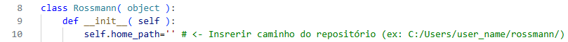

Inserir o caminho até o repositório de arquivos do projeto no arquivo handler.py:

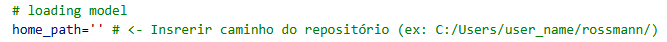

Inserir o IP e porta de execução da API no API_tester.ipynb:

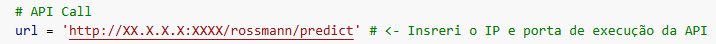

## Aplicativo web

Inserir o endereço do domínio do aplicativo hospedado no servidor web no API_tester.ipynb:

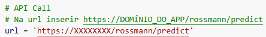

## Aplicativo chatbot para Telegram

Na seção API Call do rossmann-bot.py deve-se inserir o domínio do aplicativo hospedado no servidor web:

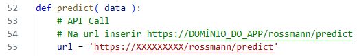

No início do mesmo arquivo há um local para inserir o token de identificação do chatbot criado pelo BotFather do Telegram. O processo para a criação de um bot de Telegram está na documentação do aplicativo Telegram.

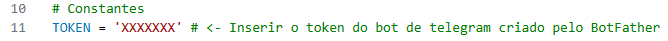

Após hospedar o aplicativo do chatbot em um servidor, deve-se executar o webhook para ativa-lo. Pode-se fazer isso digitando o seguinte endereço em um browser:

`https://api.telegram.org/botXXXXXXX/setWebhook?url=https://DOMINIO`

Onde o termo XXXXXXX deve ser substituído pelo token do bot e o termo DOMINIO pelo domínio do aplicativo hospedado no servidor web.